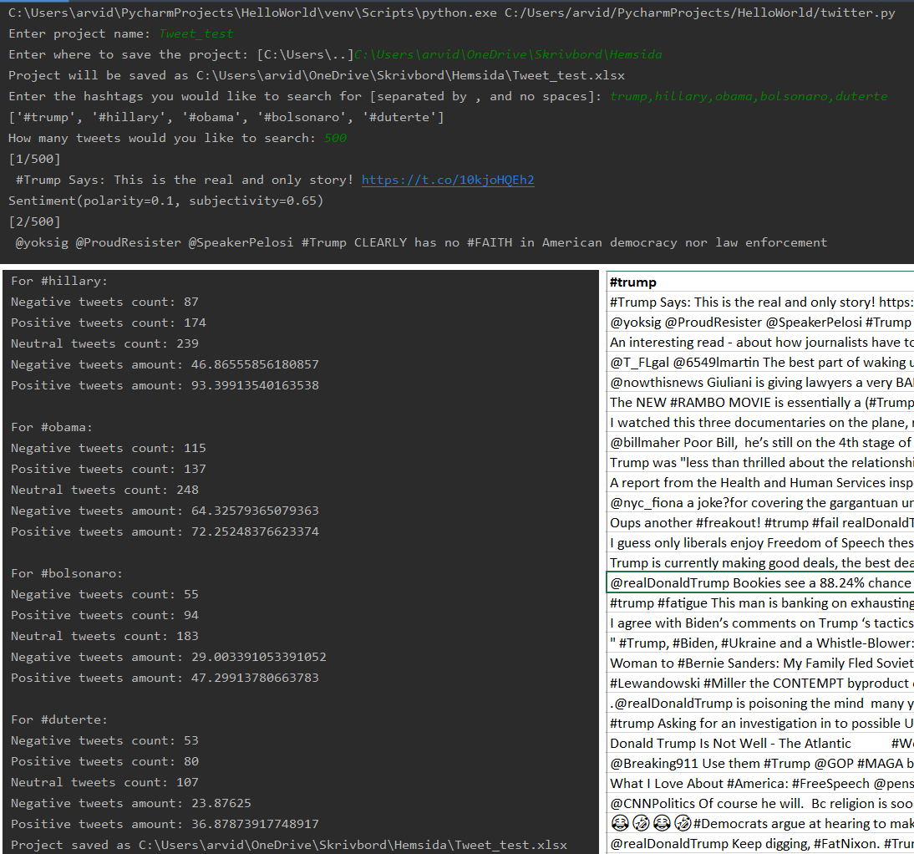

Welcome to my Twitter sentiment analyzer!

This program let's the user create a sentiment analysis on tweets gathered through Twitter's resting API. 

Enter any number of hashtags, how many tweets to retrieve and let the program load. 
All the data will be saved in an Excel file.

Try searching for presidents, countries, recent news etc! 

Enjoy!

Created by Arvid Landmark, August 2019.

